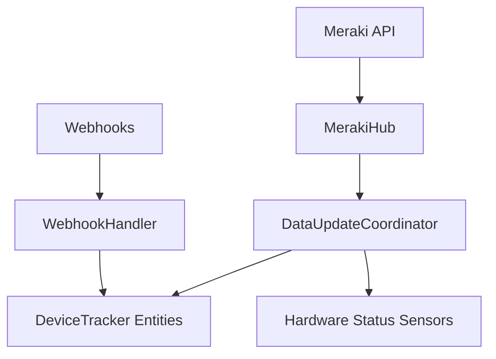

# Architecture Patterns

**Domain:** Network Device Hubs
**Researched:** February 2025

## Recommended Architecture

A hierarchical coordinator-based architecture is recommended to handle Meraki's multi-layered structure (Organization > Network > Device > Client).

### Component Boundaries

| Component                 | Responsibility                                       | Communicates With                      |
| ------------------------- | ---------------------------------------------------- | -------------------------------------- |
| `MerakiHub`               | Central API wrapper & session management.            | Meraki SDK                             |
| `OrganizationCoordinator` | Fetches metadata for organizations.                  | `MerakiHub`                            |
| `NetworkCoordinator`      | Fetches data for specific networks (SSIDs, clients). | `MerakiHub`, `OrganizationCoordinator` |
| `ClientTracker`           | Manages `DeviceTrackerEntity` lifecycle.             | `NetworkCoordinator`                   |
| `HardwareSensor`          | Manages status sensors for APs/Switches.             | `NetworkCoordinator`                   |

### Data Flow



## Patterns to Follow

### Pattern 1: Multi-Coordinator Synchronization

**What:** Use separate coordinators for global network status vs per-device status if the API requires distinct calls.
**When:** To avoid blocking global updates due to a single device failure.
**Example:**

```python
# Create a global coordinator for network status
self.coordinator = DataUpdateCoordinator(
    self.hass,
    _LOGGER,
    name="meraki_network",
    update_method=self.async_update_data,
    update_interval=timedelta(seconds=30),
)
```

### Pattern 2: Bulk Update Injection

**What:** Inject push data (webhooks) directly into the coordinator's data store using `async_set_updated_data`.
**When:** When a webhook provides more recent data than the last poll.
**Instead of:** Triggering an immediate full poll, which is wasteful.

## Anti-Patterns to Avoid

### Anti-Pattern 1: Individual Entity Polling

**What:** Each entity implementing `async_update`.
**Why bad:** 1000 entities = 1000 API calls per cycle, causing instant rate limiting.
**Instead:** Use `CoordinatorEntity` and bulk-fetch in the coordinator.

### Anti-Pattern 2: Blocking the Event Loop with Synchronous SDK Calls

**What:** Calling the `meraki` SDK directly in the main thread.
**Why bad:** Freezes Home Assistant UI and automations during I/O.
**Instead:** Wrap calls in `hass.async_add_executor_job` or use an async version of the SDK if available.

## Scalability Considerations

| Concern         | At 100 users   | At 10K users          | At 1M users                |
| --------------- | -------------- | --------------------- | -------------------------- |
| API Rate Limits | 1 call per 30s | Batching essential    | Webhooks mandatory         |
| Memory Usage    | Low            | Registry filtering    | External DB recommendation |
| HA Startup Time | Seconds        | Multi-stage discovery | Async initialization       |

## Sources

- [Home Assistant Integration: Coordinator Best Practices](https://developers.home-assistant.io/docs/integration_fetching_data/)
- [Meraki API Rate Limiting Guide](https://developer.cisco.com/meraki/api-v1/rate-limits/)
