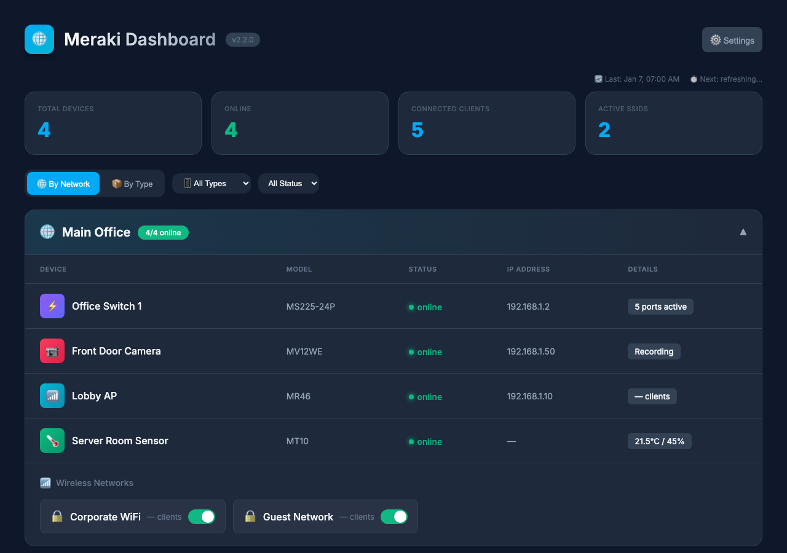
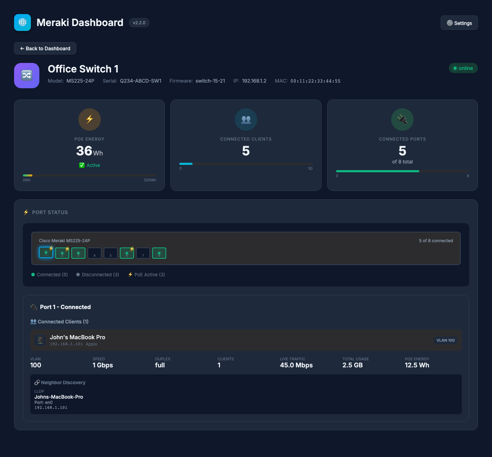
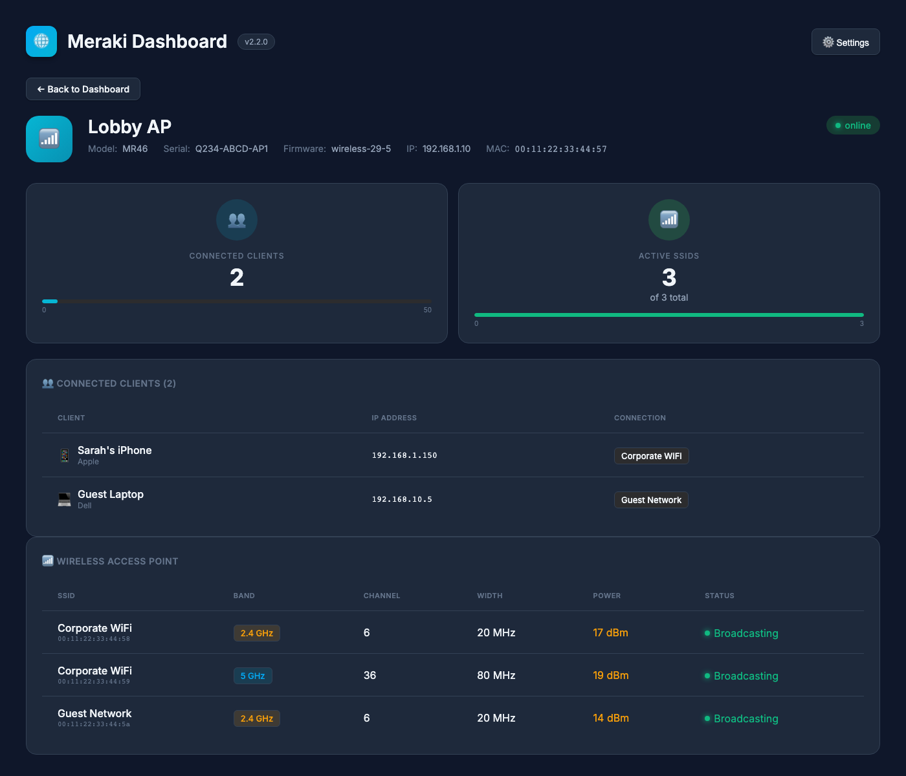
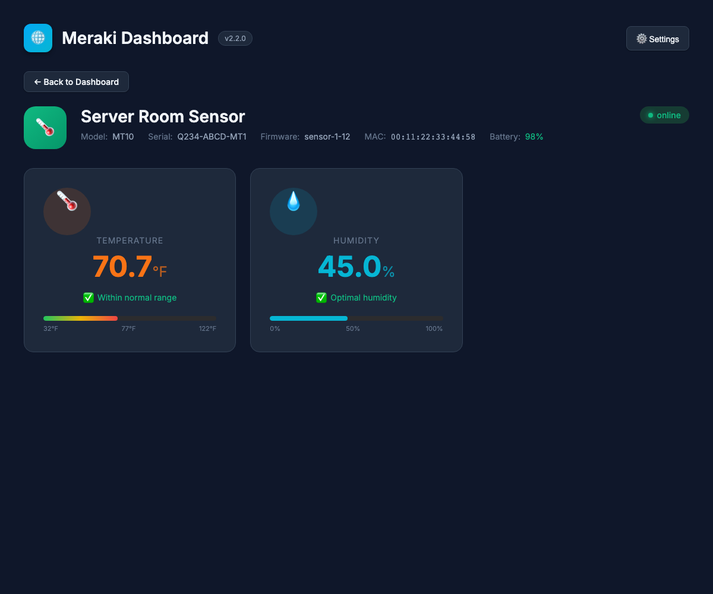
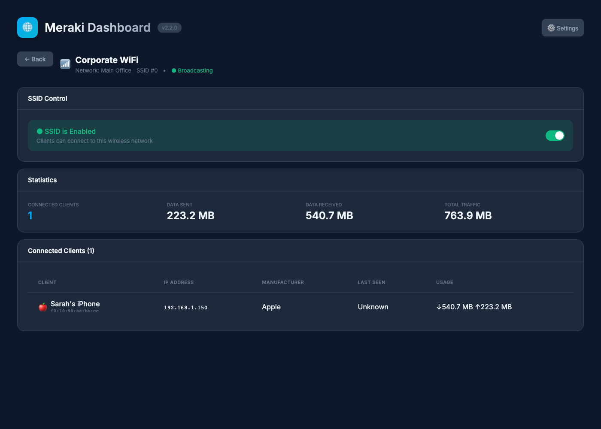
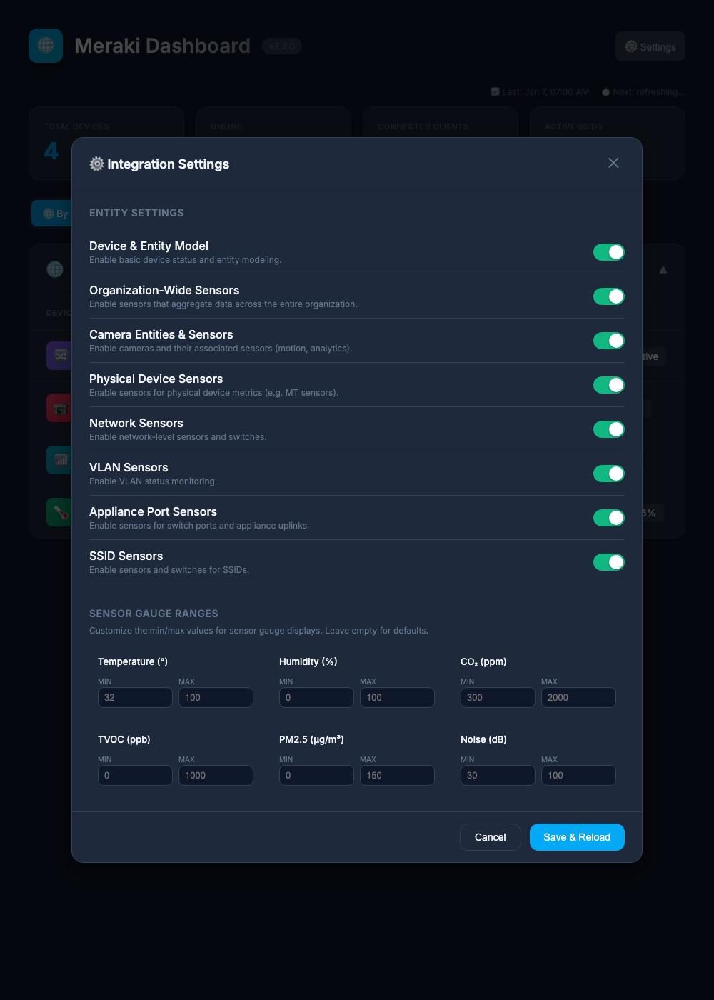
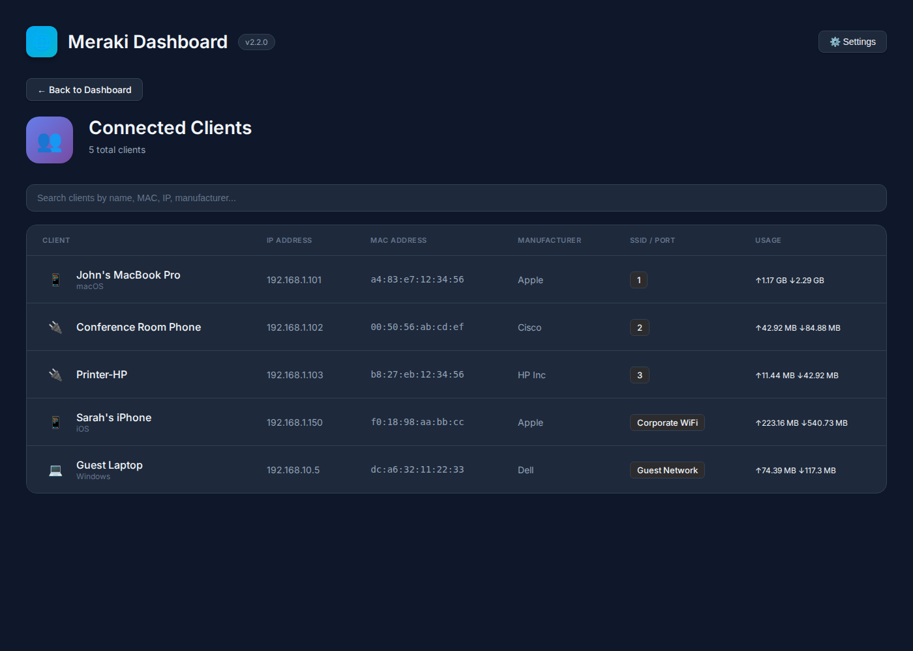
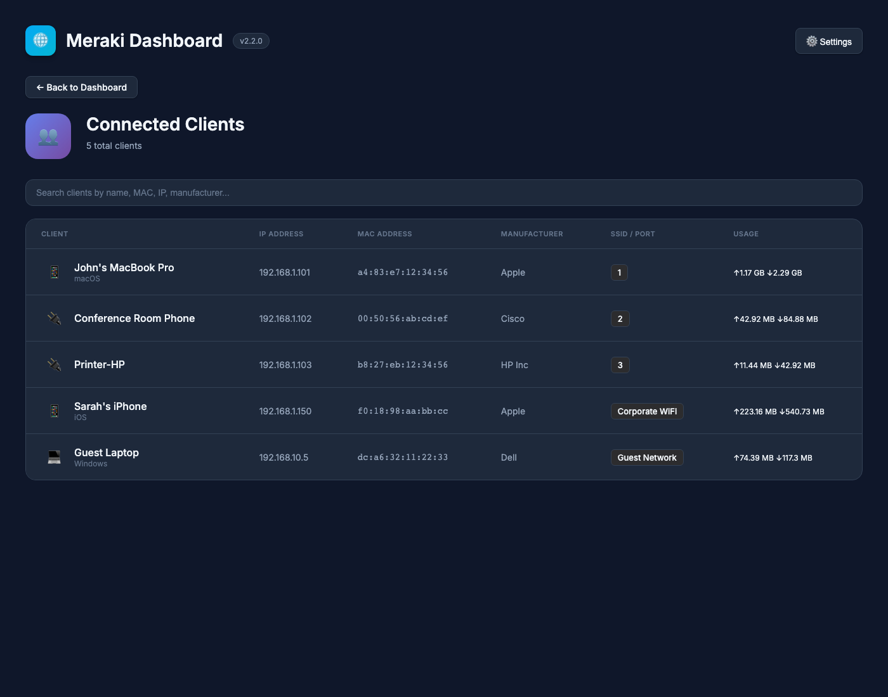

# Meraki Home Assistant Integration

[](https://github.com/liptonj/meraki-homeassistant/actions/workflows/beta-ci.yaml)
[](https://github.com/liptonj/meraki-homeassistant/actions/workflows/main-ci.yaml)

[](https://github.com/astral-sh/ruff)

This Home Assistant integration allows you to monitor and manage your Cisco Meraki network, including devices, networks, and SSIDs. It leverages the Meraki API to bring data from your Meraki dashboard into Home Assistant, enabling you to gain insights into your network and automate actions based on its status.

> **Note:** This project is a fork of the original work by [@brewmarsh](https://github.com/brewmarsh), now actively maintained by [@liptonj](https://github.com/liptonj).

## Table of Contents

- [Screenshots](#screenshots)
- [Key Features](#key-features)
- [Installation](#installation)
- [Configuration](#configuration)
- [Web UI Dashboard](#web-ui-dashboard)
  - [Dashboard Views](#dashboard-views)
  - [Switch Port Visualization](#switch-port-visualization)
  - [Wireless AP Details](#wireless-ap-details)
  - [SSID Management](#ssid-management)
  - [Camera Linking (NVR Integration)](#camera-linking-nvr-integration)
  - [Connected Clients](#connected-clients)
  - [Settings Panel](#settings-panel)
- [Entities](#entities)
- [Services & Controls](#services--controls)
- [Troubleshooting](#troubleshooting)
- [Contributing](#contributing)

## Screenshots

<details open>
<summary><strong>📊 Dashboard View</strong></summary>
<p align="center">
  
</p>
<p><em>Main dashboard showing device overview organized by network with status indicators, filtering options, and quick stats.</em></p>
</details>

<details>
<summary><strong>🔀 Switch Port Visualization</strong></summary>
<p align="center">
  
</p>
<p><em>Interactive switch port diagram with PoE indicators, LLDP/CDP neighbor discovery, and per-port traffic statistics.</em></p>
</details>

<details>
<summary><strong>📶 Wireless AP Details</strong></summary>
<p align="center">
  
</p>
<p><em>Access point view showing BSS details per radio, connected clients, and SSID broadcasting status.</em></p>
</details>

<details>
<summary><strong>🌡️ Sensor Gauges</strong></summary>
<p align="center">
  
</p>
<p><em>Environmental sensor display with temperature (°F) and humidity gauges, battery status, and customizable ranges.</em></p>
</details>

<details>
<summary><strong>📡 SSID Management</strong></summary>
<p align="center">
  
</p>
<p><em>SSID detail view with enable/disable toggle, traffic statistics, and connected client list.</em></p>
</details>

<details>
<summary><strong>⚙️ Settings Panel</strong></summary>
<p align="center">
  
</p>
<p><em>Integration settings with entity toggles and customizable sensor gauge ranges.</em></p>
</details>

<details>
<summary><strong>👥 Connected Clients</strong></summary>
<p align="center">
  
</p>
<p><em>Searchable client list with manufacturer, OS, connection type, and usage statistics.</em></p>
</details>

<details>
<summary><strong>👤 Client Details</strong></summary>
<p align="center">
  
</p>
<p><em>Individual client view showing session details, bandwidth usage, and connected device information.</em></p>
</details>

## Key Features

### Comprehensive Monitoring

- **All Meraki Hardware:** Monitor Wireless Access Points (MR/GR), Switches (MS/GS), Security Appliances (MX), Cameras (MV), and Environmental Sensors (MT)
- **Real-time Status:** Device online/offline status, firmware versions, and uptime tracking
- **Rich Sensor Data:** Client counts, data usage, PoE consumption, and much more

### Web UI Dashboard

- **Dashboard View Modes:** View devices organized by Network or by Device Type
- **Device & Status Filtering:** Filter devices by type (Switch, Camera, Wireless, Sensor, Appliance) and status (Online, Offline, Alerting)
- **Real-time Refresh:** Countdown timer shows when data will be refreshed
- **Switch Port Visualization:** Interactive port diagram with LLDP/CDP neighbor discovery
- **Sensor Gauges:** Visual temperature, humidity, and air quality displays
- **Connected Clients:** Searchable client list with usage statistics

### Camera Integration

- **Live Snapshots:** View camera snapshots directly in the dashboard
- **Cloud Video Links:** Quick access to Meraki cloud video
- **NVR Camera Linking:** Link Meraki cameras to external NVR camera entities (Blue Iris, Frigate, etc.)

### Powerful Controls

- **SSID Management:** Enable/disable SSIDs directly from Home Assistant
- **Network Selection:** Choose which networks to monitor via integration settings

### Entity Types

- **Organization Sensors:** Aggregate metrics across your entire organization
- **Device Sensors:** Per-device status, uptime, and hardware metrics
- **Network Sensors:** Network-level statistics and configuration
- **SSID Sensors:** Per-SSID client counts, bandwidth settings, and PSK values
- **Environmental Sensors (MT):** Temperature, humidity, air quality, CO2, noise levels

## Installation

### Prerequisites

- Home Assistant 2024.1.0 or newer
- A Cisco Meraki account with API access enabled
- Your Meraki API key and Organization ID

### Via HACS (Recommended)

1. Ensure [HACS](https://hacs.xyz/) is installed
2. In HACS, go to **Integrations** > **Custom repositories**
3. Add `https://github.com/liptonj/meraki-homeassistant` as an Integration
4. Search for "Meraki" and install
5. Restart Home Assistant

### Manual Installation

1. Download the `custom_components/meraki_ha` folder
2. Copy it to your Home Assistant `custom_components` directory
3. Restart Home Assistant

## Configuration

### Obtaining API Credentials

1. Log in to [Meraki Dashboard](https://dashboard.meraki.com/)
2. Navigate to **Organization** > **Settings** and enable API access
3. Go to **My profile** > **API access** and generate a new API key
4. Note your Organization ID (shown at the bottom of every dashboard page)

### Setting up the Integration

1. Go to **Settings** > **Devices & Services**
2. Click **+ ADD INTEGRATION** and search for "Meraki"
3. Enter your API Key and Organization ID
4. Configure options as needed

### Configuration Options

| Option                  | Description                                       | Default |
| ----------------------- | ------------------------------------------------- | ------- |
| Scan Interval           | How often to poll the Meraki API (seconds)        | 300     |
| Temperature Unit        | Celsius or Fahrenheit                             | Celsius |
| Dashboard View Mode     | Default view: by Network or by Type               | Network |
| Camera Link Integration | Filter cameras by integration (e.g., "blue_iris") | All     |

## Web UI Features

The integration adds a **Meraki** panel to your Home Assistant sidebar with a comprehensive dashboard.

### Dashboard Views

The dashboard supports two view modes:

- **By Network:** Devices grouped by their Meraki network
- **By Type:** Devices grouped by product type (Switches, Cameras, Wireless, Sensors, Appliances)

Use the filter dropdowns to narrow down by device type or status (Online, Offline, Alerting, Dormant).

### Switch Port Visualization

For Meraki switches, the device detail view includes an interactive port visualization:

- **Visual Port Status:** See connected/disconnected ports at a glance
- **PoE Indicators:** Identify which ports are providing power
- **Click for Details:** Click any port to see:
  - Connected client name and MAC address
  - Speed, duplex, and VLAN information
  - Traffic statistics (live and cumulative)
  - PoE power consumption
  - LLDP/CDP neighbor discovery data

### Wireless AP Details

For Meraki wireless access points (MR series), the device detail view shows:

- **Connected Clients:** Real-time count of clients connected to this AP
- **Active SSIDs:** Number of SSIDs currently broadcasting from this AP
- **Device Information:** LAN IP, MAC address, and firmware version
- **BSS Details:** Per-radio SSID information including channel, channel width, and power settings
- **Client List:** Table of connected clients showing name, IP, manufacturer, and which SSID they're on

### SSID Management

The dashboard's Wireless Networks section allows you to manage your SSIDs directly:

- **Quick Toggle:** Enable or disable SSIDs with a single click
- **SSID Details:** Expand any SSID to see:
  - SSID number and enabled status
  - Connected client count
  - List of connected devices with links to device details
- **Real-time Updates:** Changes take effect immediately via the Meraki API

### Camera Linking (NVR Integration)

**Why this feature exists:** Meraki cameras only support **one RTSP destination** at a time. If your RTSP stream goes to a local NVR (like Blue Iris, Frigate, or Synology Surveillance Station), you cannot also stream directly to Home Assistant.

**Solution:** Link your Meraki camera to the NVR's camera entity in Home Assistant:

1. Navigate to the camera's device detail view in the Meraki panel
2. Click **Link Camera** to open the configuration
3. Select your NVR's camera entity from the dropdown (e.g., `camera.blue_iris_front_door`)
4. Click **Save**

**Result:** You can now view the live stream from your NVR camera while retaining access to Meraki snapshots and cloud video links.

### Connected Clients

Click on the **Connected Clients** stat card to view all clients on your network:

- **Search:** Filter by name, MAC, IP, manufacturer, or OS
- **Client Details:** Click any client to see detailed information including usage stats, connection history, and the device they're connected to
- **Navigation:** Click through to view the device a client is connected to

### Settings Panel

Click the **Settings** button in the top-right corner to access the Integration Settings:

- **Entity Settings:** Toggle which entity types to create:
  - Device & Entity Model, Organization-Wide Sensors, Camera Entities
  - Physical Device Sensors, Network Sensors, VLAN Sensors
  - Appliance Port Sensors, SSID Sensors
- **Sensor Gauge Ranges:** Customize min/max values for gauge displays:
  - Temperature (°F), Humidity (%), CO₂ (ppm)
  - TVOC (ppb), PM2.5 (µg/m³), Noise (dB)

## Entities

The integration creates the following entity types:

| Entity Type        | Examples                                                           |
| ------------------ | ------------------------------------------------------------------ |
| **Sensors**        | Device status, client counts, uplink status, temperature, humidity |
| **Binary Sensors** | Port connection status, device online/offline                      |
| **Switches**       | SSID enable/disable                                                |
| **Cameras**        | MV camera entities with RTSP streaming                             |
| **Update**         | Firmware update availability                                       |

## Services & Controls

### SSID Management

Toggle SSIDs on or off using the switch entities or via service calls:

```yaml
service: switch.turn_off
target:
  entity_id: switch.guest_wifi
```

### Automation Examples

**Alert when a device goes offline:**

```yaml
automation:
  - alias: 'Meraki Device Offline Alert'
    trigger:
      - platform: state
        entity_id: sensor.office_switch_status
        to: 'offline'
    action:
      - service: notify.mobile_app
        data:
          message: 'Office Switch is offline!'
```

**Turn off guest WiFi at night:**

```yaml
automation:
  - alias: 'Disable Guest WiFi at Night'
    trigger:
      - platform: time
        at: '23:00:00'
    action:
      - service: switch.turn_off
        target:
          entity_id: switch.guest_network
```

## Troubleshooting

### Common Issues

| Issue                | Solution                                          |
| -------------------- | ------------------------------------------------- |
| No devices appearing | Verify API key has access to the organization     |
| Entities unavailable | Check Home Assistant logs for API errors          |
| Slow updates         | Increase scan interval if hitting API rate limits |
| Camera not streaming | Ensure RTSP is enabled in Meraki Dashboard        |

### Debug Logging

Enable debug logging by adding to `configuration.yaml`:

```yaml
logger:
  default: info
  logs:
    custom_components.meraki_ha: debug
```

### Getting Help

1. Check the [Home Assistant logs](https://www.home-assistant.io/integrations/logger/) for error messages
2. [Open an issue](https://github.com/liptonj/meraki-homeassistant/issues) on GitHub
3. Include your HA version, integration version, and relevant log entries

## Contributing

Contributions are welcome! Please read our:

- [CONTRIBUTING.md](CONTRIBUTING.md) - How to contribute
- [DEVELOPMENT.md](DEVELOPMENT.md) - Development setup guide

---

_This project is a community effort and is not affiliated with or endorsed by Cisco Meraki._
