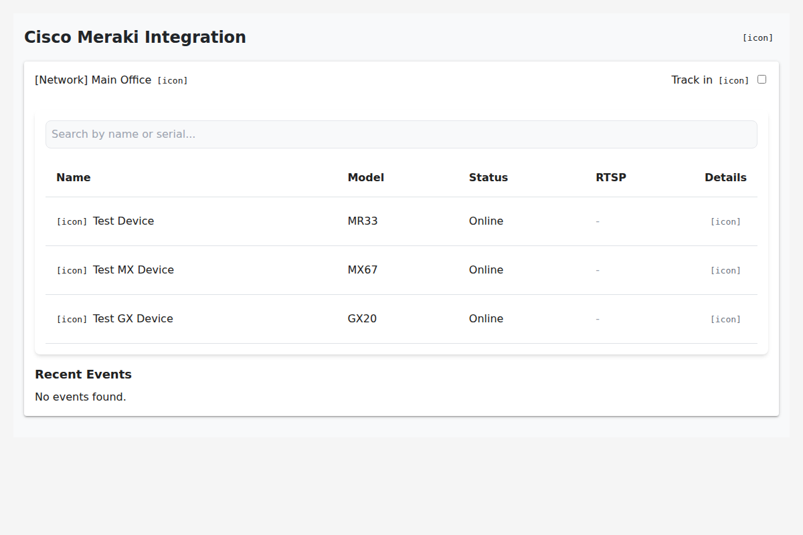
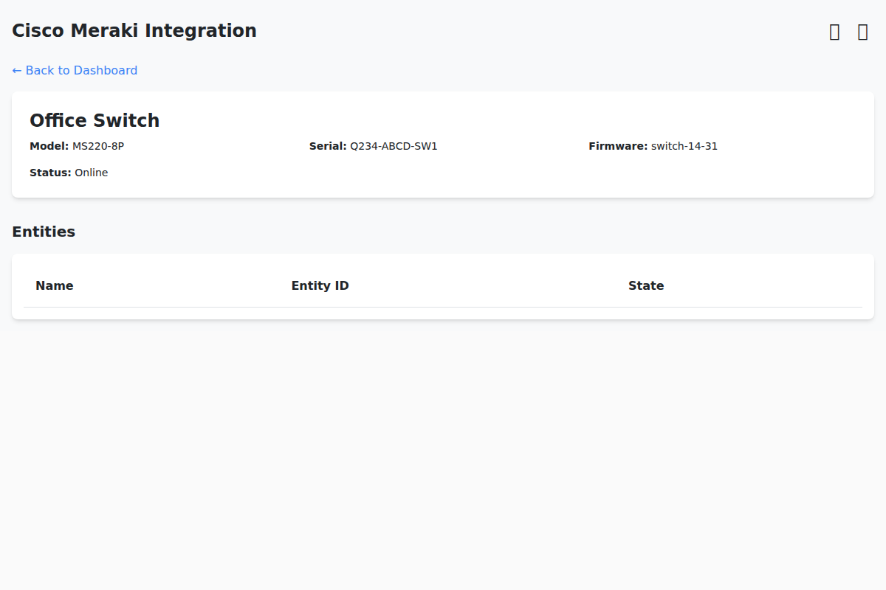

# Meraki Home Assistant Integration 🏠☁️

Welcome to the **Meraki Home Assistant Integration**! This project bridges the gap between your Cisco Meraki cloud-managed network and your local Home Assistant instance. Whether you're managing a home lab, a small business, or just love having total control over your network gear, this integration has you covered.

**Note:** This is currently in **Beta**. We're moving fast and improving stability, so feedback is always welcome!

## ✨ Features

We support a wide range of Meraki devices and features, bringing cloud management down to earth:

### 📹 Cameras (MV Series)
Keep an eye on things with robust camera integration.
*   **Live Status:** See if your cameras are online or offline instantly.
*   **Streaming:** View RTSP streams directly in your dashboard (requires local access).
*   **Motion Detection:** (Where supported) trigger automations based on camera activity.

### 🔌 Switches (MS & Meraki Go GS)
Manage your wired network like a pro.
*   **Port Control:** Cycle power to PoE ports to reboot sticky devices remotely.
*   **Monitoring:** Track power usage (PoE) and connectivity status per port.
*   **VLANs:** View VLAN configurations and status.

### 🌡️ Sensors (MT Series)
Environmental monitoring made easy.
*   **Complete Range:** Support for MT10 (Temp/Humidity), MT11 (Temp/Probe), MT12 (Water Leak), MT14 (Air Quality), and MT20 (Door Open/Close).
*   **MT40:** Full support for the MT40 Smart Power Controller (new!).

### 📶 Wireless (MR & Meraki Go GR)
Control your Wi-Fi experience.
*   **SSID Management:** Toggle SSIDs on or off dynamically.
*   **Client Counts:** See how many devices are connected to each network in real-time.

### 🛡️ Gateways (MX & Meraki Go GX)
*   **Uplink Status:** Monitor your internet connection health and failover status.

## 🖥️ The Dashboard

We've built a custom **Meraki Panel** right into Home Assistant. It gives you a bird's-eye view of your organization without needing to clutter your standard Lovelace dashboard with hundreds of entities.

*The Network View provides a quick summary of all your sites.*

*Drill down into specific devices for detailed controls and metrics.*

## 🚀 Getting Started

1.  **Install:** Use HACS (recommended) to install "Meraki Home Assistant". Alternatively, copy the `custom_components/meraki_ha` folder to your HA `custom_components` directory.
2.  **Configure:** Go to **Settings > Devices & Services > Add Integration** and search for "Meraki".
3.  **API Key:** Enter your Meraki Dashboard API Key. The integration will discover your organizations.
4.  **Enjoy:** Check out the new "Meraki" panel in your sidebar!

## 🤝 Contributing

We love contributions! Please read our [CONTRIBUTING.md](CONTRIBUTING.md) and [DEVELOPMENT.md](DEVELOPMENT.md) guides to get started.

---
*Built with ❤️ by the Open Source Community.*
