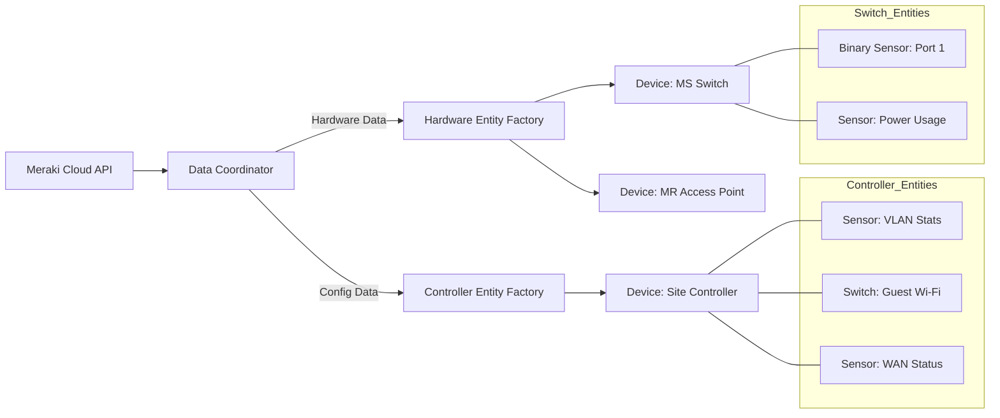
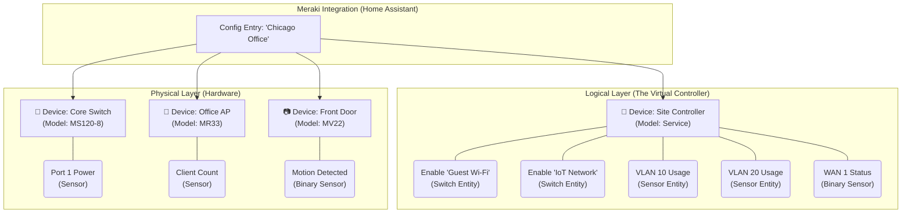

A design document is the perfect place to articulate the "Why" and "How" of this architectural shift. Moving from a "Device-per-Entity" model to a "Virtual Controller" pattern is a major change in how users interact with the integration, so clarity is key.

Here is a comprehensive design section you can drop directly into your documentation.

---

# Architecture Refactor: The Virtual Controller Pattern

## 1. Executive Summary

This refactor transitions the Meraki integration from a "Logical Object" model (where SSIDs and VLANs are individual Devices) to a "Physical & Controller" model. This aligns the integration with Home Assistant's core design philosophy: **Devices represent physical hardware, while Services represent logical configuration.**

## 2. Problem Statement (Current State)

The current architecture treats every API object as a unique Home Assistant Device. This leads to:

* **Device Registry Bloat:** A simple network with 1 Switch, 3 APs, 4 SSIDs, and 5 VLANs results in **13 Devices** (4 physical + 9 logical).
* **Fragmented UX:** Users must hunt for a specific "Guest Wi-Fi" device to toggle a switch, rather than finding it centrally.
* **Ambiguous Ownership:** Logical entities (like VLAN stats) are arbitrarily attached to physical devices (like an MX Appliance), causing confusion if that specific hardware is replaced or offline.

## 3. Proposed Architecture (Future State)

We will implement a **Virtual Controller Pattern**. This introduces a single, logical "Service Device" for each Meraki Network (Site) that aggregates all non-hardware entities.

### 3.1 Device Taxonomy

The integration will produce two distinct classes of devices:

| Device Class | Represents | Examples | Entities Attached |
| --- | --- | --- | --- |
| **Physical Device** | Tangible hardware with a serial number. | MR Access Points, MS Switches, MV Cameras, MT Sensors | Hardware health (Temp, Power), Port Status, Connectivity Sensors. |
| **Virtual Controller** | The logical "Network" or "Site" configuration. | "Chicago Office", "Home Network" | SSID Toggles, VLAN Stats, Uplink Status, Content Filtering Switches. |

### 3.2 Entity Mapping Strategy

#### A. Wireless (SSIDs)

* **Old Way:** `[SSID] Guest Wi-Fi` Device → `switch.guest_wifi`
* **New Way:** `[Site] Chicago Office` Device → `switch.guest_wifi_enabled`
* **Rationale:** An SSID is a broadcast profile pushed to *all* APs in a network. It is a site-wide configuration, not a standalone device.

#### B. Network & Routing (VLANs)

* **Old Way:** `[VLAN] 10` Device → 5 separate sensors (IP, Mask, etc.)
* **New Way:** `[Site] Chicago Office` Device → `sensor.vlan_10_status`
* **Attribute Flattening:** To reduce entity count, VLAN details (Subnet, IPv6 status) will be moved to **Attributes** of the primary VLAN status sensor.

#### C. Switching (Ports)

* **Old Way:** All 48 ports enabled as sensors by default.
* **New Way:**
* **Default:** Only `uplink` and `power_usage` sensors are enabled.
* **Opt-In:** Individual port status/toggle entities are `disabled_by_default`. Users enable specific ports (e.g., "Port 4 - Printer") manually.


## 4. Technical Implementation

### 4.1 The "Service" Device Helper

We will introduce a helper class `MerakiNetworkDevice` that generates the standardized Virtual Controller info.

```python
# pseudo-code structure
def get_virtual_controller_info(network_id, network_name):
    return DeviceInfo(
        identifiers={(DOMAIN, network_id)},
        name=f"Site: {network_name}",
        manufacturer="Cisco Meraki",
        model="Cloud Controller Service",
        entry_type=DeviceEntryType.SERVICE, # Icon: Cloud/Server
    )

```

### 4.2 Migration Path (Breaking Change)

Since this changes `unique_id` generation and Device associations, this is a **Breaking Change**.

* **Users must:** Delete the existing integration entry and re-add it.
* **Orphan cleanup:** The refactor code must include a migration step to identify and remove the old "Logical" devices (`[SSID] ...`, `[VLAN] ...`) from the registry to prevent duplicates.

## 5. User Experience Improvements

* **Centralized Control:** A single dashboard card for "Chicago Office" now displays global network health (Uplink), configuration (SSIDs), and addressing (VLANs).
* **Hardware Focus:** The "Devices" list now accurately reflects the physical inventory (racks, shelves, ceilings).
* **Simplified Automations:** Triggers become more intuitive: `device: Chicago Office` -> `action: Turn off Guest Wi-Fi`.

---

### **Visualizing the Data Flow**

This diagram shows how the API data flows into the new architecture.



Here is a mockup formatted for your architectural refactor document. This visualizes the **"Virtual Controller" Pattern**, where logical entities (SSIDs, VLANs) are aggregated under a single "Site" device, keeping the physical hardware devices clean.

### **1. Architectural Hierarchy Diagram**

This diagram illustrates the relationship between the physical hardware and the new logical "Site Controller."



---

### **2. UI Mockup: The "Site Controller" Device Page**

This is how the **logical device** would appear in the Home Assistant frontend. Note how it aggregates all the high-level network configurations that were previously scattering across multiple devices.

```text
+-----------------------------------------------------------------------+
|  < Back    Device: [Site] Chicago Office                              |
+-----------------------------------------------------------------------+
|  Device Info                                                          |
|  -----------                                                          |
|  Manufacturer: Meraki                                                 |
|  Model: Network Controller (Service)                                  |
|  Firmware: Cloud Managed                                              |
+-----------------------------------------------------------------------+
|                                                                       |
|  CONTROLS (SSIDs & Policy)                                            |
|  -------------------------------------------------------------------  |
|  [ Switch ]  Guest Wi-Fi Enabled            ( O )  ON                 |
|  [ Switch ]  IoT Network Enabled            (   )  OFF                |
|  [ Switch ]  Staff Wi-Fi Enabled            ( O )  ON                 |
|  [ Switch ]  Content Filtering: Block Adult ( O )  ON                 |
|                                                                       |
|  SENSORS (VLANs & Uplink)                                             |
|  -------------------------------------------------------------------  |
|  [ Sensor ]  WAN 1 Public IP                203.0.113.5               |
|  [ Sensor ]  WAN 1 Usage                    45.2 Mbps                 |
|  [ Sensor ]  VLAN 10 (Staff) Subnet         192.168.10.0/24           |
|  [ Sensor ]  VLAN 20 (Guest) Subnet         192.168.20.0/24           |
|  [ Sensor ]  Network Security Score         85%                       |
|                                                                       |
|  DIAGNOSTICS                                                          |
|  -------------------------------------------------------------------  |
|  [ Binary ]  Meraki Cloud Connection        Connected                 |
|  [ Binary ]  License Compliance             Compliant                 |
|                                                                       |
+-----------------------------------------------------------------------+

```

### **3. Implementation Details for the Refactor**

To achieve this in your code, you need to change how `device_info` is constructed for these logical entities.

**In `custom_components/meraki_ha/entity.py` (or specific provider):**

```python
from homeassistant.helpers.device_registry import DeviceEntryType

class MerakiLogicalEntity(MerakiEntity):
    """Base class for entities that belong to the Site Controller."""

    @property
    def device_info(self):
        return {
            "identifiers": {(DOMAIN, self.network_id)},  # ID is the Network ID, not hardware Serial
            "name": f"Site: {self.network_name}",
            "manufacturer": "Cisco Meraki",
            "model": "Network Controller Service",
            "entry_type": DeviceEntryType.SERVICE,  # Critical: Marks this as a virtual service
            "configuration_url": f"https://dashboard.meraki.com/...",
        }

```

**Why this is better:**

1. **Grouped Context:** Users find "Guest Wi-Fi" settings where they expect them (at the site level), not on a random AP or a disconnected "SSID Device."
2. **Scalability:** If you have 10 VLANs and 4 SSIDs, you get **1 Device** with 14 entities, instead of **14 Devices** with 1 entity each.
3. **Physical Purity:** Your switch and AP device pages remain focused purely on hardware stats (temperature, ports, power), making troubleshooting easier.
